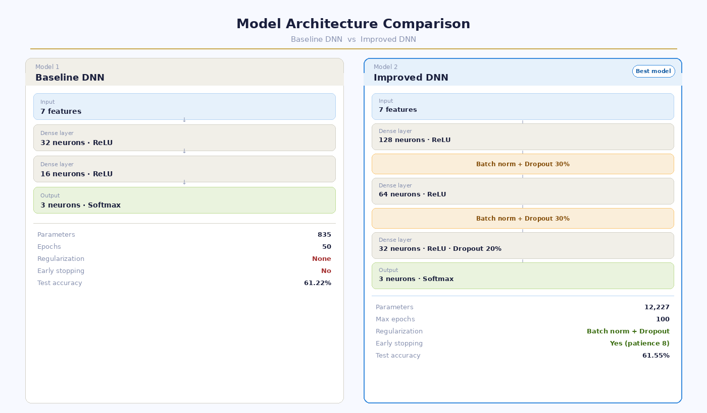
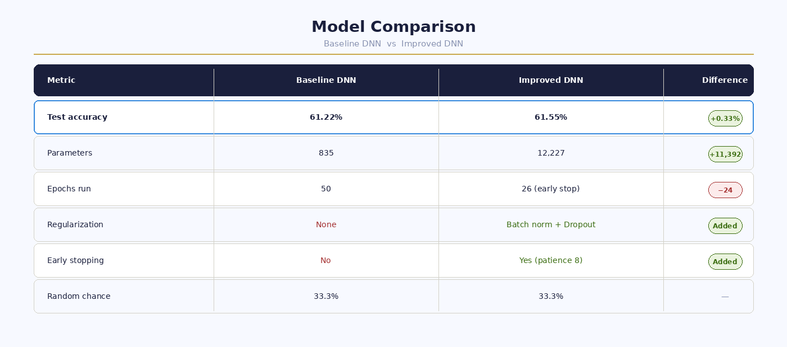

# Chess Game Outcome Predictor

A deep neural network trained on 20,058 real Lichess chess games to predict game outcomes — white wins, black wins, or draw — based on pre-game features like player ELO ratings, opening choice, and time control.

Built as the final project for MTH 3320 / CSC 2590 (Machine Learning) · Spring 2026

---

## Live Demo

👉 [Open the Interactive Predictor](https://yourusername.github.io/chess-outcome-predictor)

Enter any two ELO ratings and an opening to get win probabilities in real time.

---

## Results

| Model | Test Accuracy | Parameters | Regularization |
|---|---|---|---|
| Baseline DNN | 61.22% | 835 | None |
| Improved DNN | 61.55% | 12,227 | Batch norm + Dropout |

Both models significantly outperform the 33% random chance baseline for a 3-class problem.

---

## Model Architecture

---

## Model Comparison

---

## Dataset

- **Source:** [Lichess Game Dataset on Kaggle](https://www.kaggle.com/datasets/datasnaek/chess)
- **Size:** 20,058 games · 16 features
- **Classes:** White wins (10,001) · Black wins (9,107) · Draw (950)

---

## Features Used

| Feature | Description |
|---|---|
| white_rating | White player ELO rating |
| black_rating | Black player ELO rating |
| elo_diff | White ELO minus black ELO |
| turns | Number of turns in the game |
| rated | Whether the game was rated (1/0) |
| time_base | Base time control in minutes |
| opening_encoded | Opening family encoded as integer |

---

## Project Structure

| File | Description |
|---|---|
| MTH3320FinalProject.ipynb | Full project notebook with code and outputs |
| chess_predictor.html | Interactive win probability predictor |
| model_architecture_comparison.png | DNN architecture comparison image |
| model_comparison_table.png | Model results comparison image |

---

## Key Findings

- ELO difference is the strongest predictor of game outcome — visible even in the raw data before any modeling
- The improved DNN added batch normalization, dropout regularization, and early stopping over the baseline
- The draw class was the hardest to predict due to class imbalance — only 4.7% of games ended in a draw
- Both models confirmed genuine learning with 61% accuracy versus 33% random chance

---

## Tools and Libraries

Python · TensorFlow · Keras · Scikit-learn · Pandas · NumPy · Matplotlib · Seaborn · Google Colab

---

## How to Run

1. Open `MTH3320FinalProject.ipynb` in Google Colab
2. Upload your Kaggle API token to download the dataset
3. Run all cells in order
4. Open `chess_predictor.html` in any browser for the interactive demo

---

## Course

MTH 3320 / CSC 2590 · Machine Learning · Spring 2026
